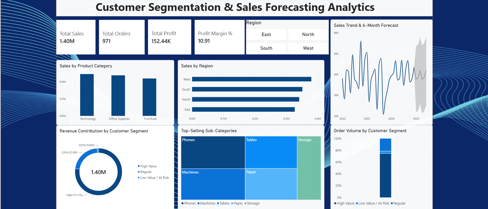

# 📊 Customer Segmentation & Sales Forecasting Analytics

### An end-to-end data analytics project using Excel and Power BI to uncover customer value patterns and forecast future sales trends.

---

## 📌 Project Overview

This project analyzes retail sales data to answer three key business questions:

1. **Who are our most valuable customers?** → Solved using RFM-based Customer Segmentation
2. **What will our future sales look like?** → Solved using Power BI's time-series Forecasting
3. **Which products and regions drive the business?** → Solved using category, region, and sub-category analysis

The result is an interactive Power BI dashboard that turns raw transactional data into clear, actionable business insights.

---

## 🎯 Objectives

- Clean and prepare raw sales data for analysis
- Segment customers into **High Value**, **Regular**, and **Low Value/At Risk** groups based on spending and order frequency
- Forecast sales for the next 6 months using historical trends
- Visualize key business metrics (Sales, Profit, Orders, Profit Margin) in a single interactive dashboard
- Identify top-performing product categories and regions

---

## 🛠️ Tools & Technologies

| Tool | Purpose |
|------|---------|
| **Microsoft Excel / Google Sheets** | Data cleaning — removing duplicates, fixing blanks, standardizing text, validating values |
| **Power BI Desktop** | Data modeling (DAX), customer segmentation, sales forecasting, dashboard visualization |
| **DAX (Data Analysis Expressions)** | Custom calculations: Customer Summary, Segmentation Logic, Profit Margin %, Average Order Value |

---

## 🧹 Data Cleaning Summary

The raw dataset contained common real-world data quality issues, which were identified and resolved:

| Issue | Action Taken | Rows Affected |
|-------|--------------|----------------|
| Duplicate records | Removed exact duplicate rows | 14 |
| Missing Sales values | Removed rows with blank Sales (critical field) | 20 |
| Invalid Quantity (0 or negative) | Removed data-entry errors | 10 |
| Inconsistent Region spelling (e.g., " north", "NORTH ") | Standardized to proper case | 25 |
| Blank Customer Names | Labeled as "Unknown" | 30 |
| Extra whitespace in text fields | Trimmed | 15 |

**Final dataset:** 971 clean, analysis-ready records (from an original 1,015).

---

## 📈 Methodology

### 1. Customer Segmentation (RFM-inspired logic)
Using DAX, customers were grouped based on **Total Sales** and **Order Count**:

- 🟦 **High Value** — High spend + frequent orders
- 🟧 **Regular** — Moderate spend
- 🟣 **Low Value / At Risk** — Low spend, infrequent orders

**Key Insight:** High Value customers contribute **77.17%** of total revenue despite being a smaller group — highlighting the importance of retention-focused strategies for this segment.

### 2. Sales Forecasting
Power BI's built-in forecasting engine was applied to the monthly sales trend line, projecting sales **6 months ahead** with a 95% confidence interval — helping anticipate future demand and plan inventory/marketing accordingly.

### 3. Supporting Analysis
- Sales by Product Category (Technology, Office Supplies, Furniture)
- Sales by Region (North, South, East, West)
- Top-Selling Sub-Categories (Treemap visualization)
- Order Volume distribution across customer segments

---

## 📊 Dashboard Preview



**Dashboard Highlights:**
- 4 KPI Cards: Total Sales, Total Orders, Total Profit, Profit Margin %
- Interactive Region slicer for dynamic filtering
- Customer Segmentation donut chart
- 6-month Sales Forecast line chart
- Category & Region performance bar charts
- Sub-Category Treemap

---

## 💡 Key Business Insights

1. **77% of revenue comes from High Value customers** — retention strategies should prioritize this segment over broad-based campaigns.
2. **Technology** is the leading product category by sales.
3. The **West region** leads in total sales among all four regions.
4. The 6-month forecast indicates [describe trend once you see it — e.g., "a steady/upward trend going into 2025"].
5. Profit margin stands at **~10.9%**, providing a baseline for evaluating future pricing or discount strategies.

---

## 🚀 How to Use This Project

1. Clone or download this repository
2. Open `superstore_sales_CLEANED.csv` to view the cleaned dataset
3. Open `Customer_Segmentation_Sales_Forecasting.pbix` in **Power BI Desktop** to explore the interactive dashboard
4. Use the Region slicer and visual tooltips to explore the data further

---

## 📁 Repository Structure

```
├── README.md
├── superstore_sales_data.csv              # Raw dataset
├── superstore_sales_CLEANED.csv           # Cleaned dataset
├── Customer_Segmentation_Sales_Forecasting.pbix   # Power BI project file
└── dashboard_screenshot.png               # Dashboard preview image
```

---

## 👤 Author

**Harish B**
Project submitted as part of academic coursework.

---

## 📬 Feedback

Suggestions and feedback are always welcome — feel free to open an issue or reach out!
